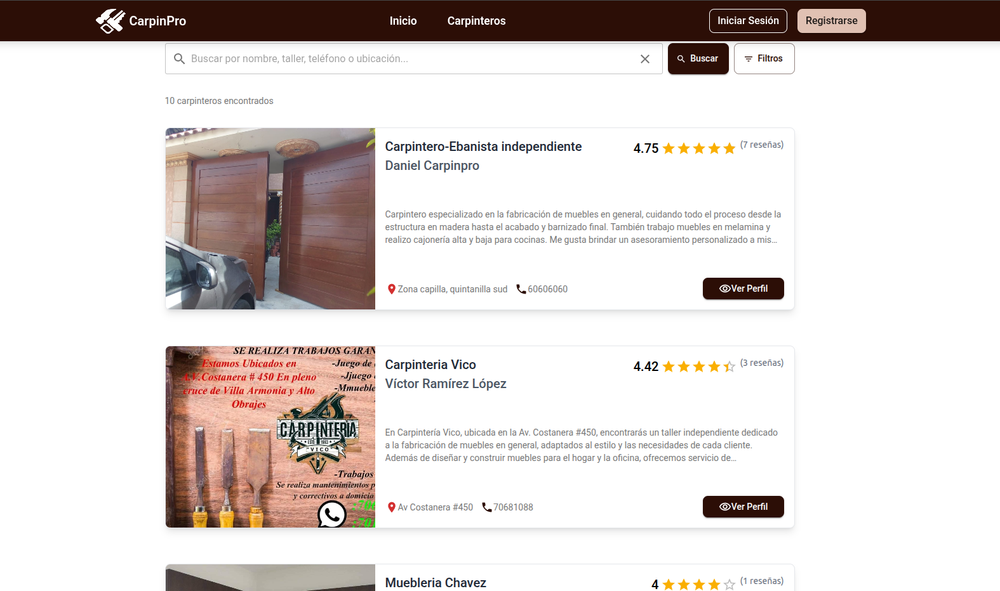
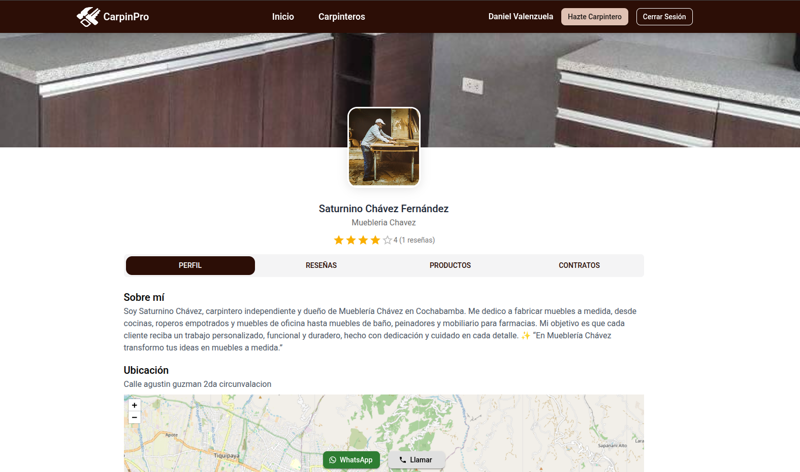
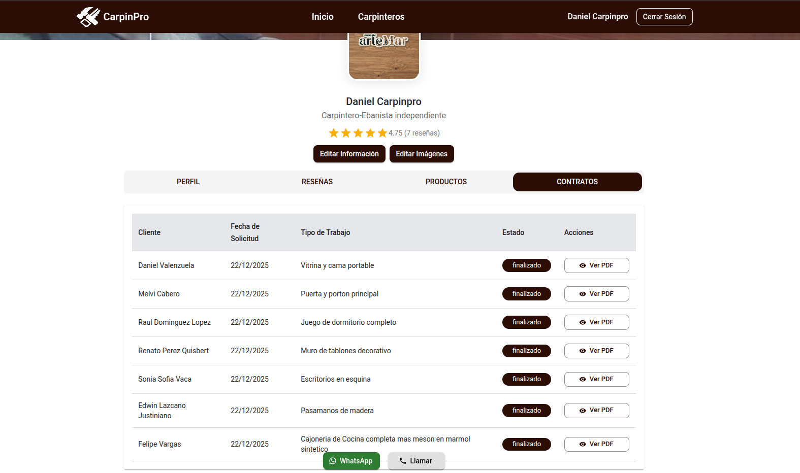
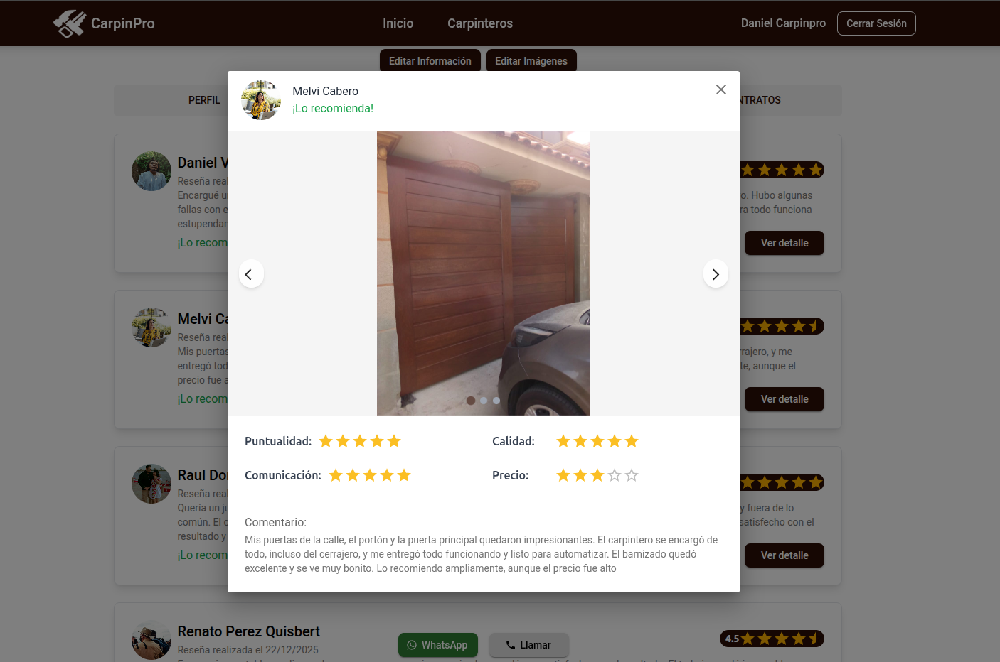

# CarpinPro

CarpinPro es una plataforma web tipo marketplace que conecta clientes con carpinteros y ebanistas, permitiendo la publicación de servicios, gestión de perfiles profesionales y solicitudes de trabajos de forma sencilla y organizada.

El sistema está diseñado para facilitar la visibilidad de profesionales del rubro y mejorar la conexión con clientes potenciales a través de una plataforma digital moderna.

---

## 🚀 Características principales

- Registro y autenticación de usuarios
- Perfiles de carpinteros con información profesional
- Publicación de servicios y trabajos
- Sistema de solicitudes de clientes
- Sistema de reseñas y calificaciones
- Gestión de publicaciones y catálogo de servicios
- Interfaz responsiva para dispositivos móviles y desktop

---

## 🧠 Arquitectura del sistema

CarpinPro está dividido en dos partes principales:

- Frontend: aplicación SPA desarrollada en React
- Backend: API REST desarrollada en Laravel

---

## 🛠️ Tecnologías

### Frontend
- React
- TypeScript
- Vite
- Tailwind CSS
- React Router
- Axios
- React Query

### Backend
- Laravel 11
- PHP 8+
- PostgreSQL
- Sanctum Authentication
- Eloquent ORM
- REST API

---

## 🔗 Repositorios

- Frontend: https://github.com/marquezQ/ProyectoDeGradoFE.git
- Backend: https://github.com/marquezQ/ProyectoDeGradoBE.git

---

## 🌐 Demo

- Aplicación: https://app.servicapp.me

---

## 📸 Capturas
### Vista 1

### Vista 2

### Vista 3

### Vista 4

### Vista 5

